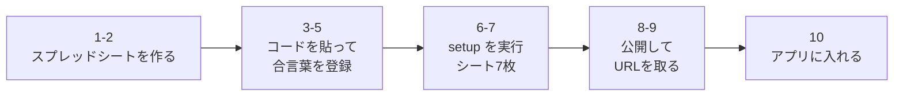

# セットアップ手順（段階1）

Google 側の準備をする手順です。**上から順に、全部で 10 ステップ**。20 分くらいで終わります。

> この作業は**あなたの Google アカウント**でおこないます。
> 妻のスマホはアプリ経由で見るので、妻に共有設定をする必要はありません。



---

## 1. スプレッドシートを作る

1. [Google ドライブ](https://drive.google.com/) を開く
2. 左上の「**＋ 新規**」→「**Google スプレッドシート**」
3. 左上の「無題のスプレッドシート」をクリックし、**warikan データ** と名前を付ける

## 2. Apps Script を開く

上のメニューから「**拡張機能**」→「**Apps Script**」。別のタブが開きます。

## 3. コードを貼る

1. 開いた画面に `function myFunction() { }` と書いてあります。**全部選んで消す**
2. このリポジトリの **`gas/コード.gs`** の中身を全部コピーして貼り付ける
3. 左上のプロジェクト名（「無題のプロジェクト」）をクリックし、**warikan** に変える
4. **保存**（フロッピーのアイコン、または `Ctrl + S`）

## 4. 合言葉を登録する

1. 左の歯車「**プロジェクトの設定**」をクリック
2. 下の方の「**スクリプト プロパティ**」→「**スクリプト プロパティを追加**」
3. こう入れる

   | プロパティ | 値 |
   |---|---|
   | `SECRET` | 2人で決めた合言葉（英数字で 12 文字以上を推奨） |

4. 「**スクリプト プロパティを保存**」

> ⚠️ この合言葉は**あなたと妻しか知らない文字列**にしてください。
> コードにも GitHub にも書きません。ここと、2人のスマホの設定画面にだけ入れます。
> 推測されやすい言葉（名字、誕生日など）は避けてください。

## 5. エディタに戻る

左の `< >`「**エディタ**」をクリック。

## 6. setup を実行してシートを作る

1. 画面上の関数のリストを「**setup**」に変える
2. 「**実行**」を押す

### 初回だけ出る「承認」の画面

Google が「このアプリは確認されていません」と警告します。**自分で書いたコードなので問題ありません**。

1. 「**権限を確認**」→ 自分の Google アカウントを選ぶ
2. 「このアプリは Google で確認されていません」→ 左下の「**詳細**」
3. 「**warikan（安全ではないページ）に移動**」
4. 「**許可**」

## 7. シートができたか確認

スプレッドシートのタブに、この 7 枚があれば成功です。

| シート名 | 中身 |
|---|---|
| レシート | レシート1枚＝1行 |
| 明細 | 品目1つ＝1行 |
| 固定費テンプレート | 家賃・電気代などの定義 |
| 固定費実績 | その月に実際にかかった額 |
| ルール | 「スーパードライ → 私」などの仕訳ルール |
| 月次精算 | 締めた結果 |
| 精算記録 | 実際に渡した記録 |

## 8. ウェブアプリとして公開する

1. Apps Script の画面右上「**デプロイ**」→「**新しいデプロイ**」
2. 左の歯車 → 「**ウェブアプリ**」を選ぶ
3. こう設定する

   | 項目 | 選ぶもの |
   |---|---|
   | 説明 | `warikan v1`（何でもよい） |
   | 次のユーザーとして実行 | **自分** |
   | アクセスできるユーザー | **全員** |

4. 「**デプロイ**」

> ⚠️ 「アクセスできるユーザー＝全員」にする理由：妻のスマホからも使うためです。
> URL を知っている人は誰でも叩けてしまうので、**合言葉で守っています**。
> URL は SNS などに貼らないでください。

## 9. URL をコピーする

「**ウェブアプリ**」の下に出る長い URL をコピーします。`/exec` で終わっているものです。

```
https://script.google.com/macros/s/（長い文字列）/exec
```

## 10. アプリに入れる

1. warikan アプリを開き、下のタブ「**設定**」
2. 「**GAS の Web App URL**」に 9 でコピーした URL を貼る
3. 「**合言葉**」に 4 で決めた合言葉を入れる
4. 「**保存してつながるか試す**」を押す
5. **「つながりました（シート 7 枚を確認）」**と出れば完成です

妻のスマホでも 10 番だけ同じようにやります（URL と合言葉を伝えるだけ）。
設定の「このスマホの持ち主」を**妻**にするのを忘れずに。

---

## 動いているか試す

1. ホームの「レシートを撮る」で 1 枚送る
2. 下のタブ「明細」に出れば保存成功
3. スプレッドシートの「レシート」「明細」シートに行が増えているのを確認
4. 妻のスマホの「明細」にも同じものが出れば、2人で共有できています

---

## つまずいたときは

| 症状 | 原因と直し方 |
|---|---|
| 「合言葉が違います」 | スクリプト プロパティの `SECRET` と、アプリに入れた合言葉が違う。前後の空白にも注意 |
| 「つながりませんでした」 | URL が違う。`/exec` で終わっているか確認。`/dev` で終わるものは使えません |
| 「サーバーが 401 / 403 を返しました」 | デプロイの「アクセスできるユーザー」が**全員**になっていない |
| 「シート『レシート』がありません」 | ステップ 6 の `setup` を実行していない |
| コードを直したのに反映されない | 「**デプロイ**」→「**デプロイを管理**」→ 鉛筆マーク → バージョンを「**新バージョン**」→「**デプロイ**」。<br>**ここが一番ハマります。** 保存だけでは公開版は変わりません |
| 承認画面で先に進めない | 「詳細」→「安全ではないページに移動」。自分のコードなので問題ありません |

---

## この先の段階

| 段階 | 中身 | 状態 |
|---|---|---|
| 1 | シート7枚・save / summary / receipt・アプリと接続 | **いまここ** |
| 2 | レシート写真をドライブに保存、2か月で自動削除 | これから |
| 3 | Gemini でレシートを読み取る | これから |
| 4〜8 | 固定費・月末締め・精算の記録・分析・公開 | これから |
