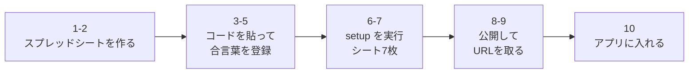

# セットアップ手順

> 画面でチェックしながら進めたい場合は、会話で渡したセットアップ用のページを使ってください。
> このファイルは同じ内容の控えです。

アプリの公開と Google 側の準備をする手順です。**全部で 12 ステップ**、20 分くらいです。

## アプリの URL

https://mitsu545.github.io/warikan-app/

GitHub Pages を有効にすると、この住所でアプリが開きます（手順 8・9）。
妻のスマホも同じ URL を開きます。

> この作業は**あなたの Google アカウント**でおこないます。
> 妻のスマホはアプリ経由で見るので、妻に共有設定をする必要はありません。



---

## 1. スプレッドシートを作る

1. [Google ドライブ](https://drive.google.com/) を開く
2. 左上の「**＋ 新規**」→「**Google スプレッドシート**」
3. 左上の「無題のスプレッドシート」をクリックし、**warikan データ** と名前を付ける

## 2. Apps Script を開く

上のメニューから「**拡張機能**」→「**Apps Script**」。別のタブが開きます。

## 3. コードを貼る

1. 開いた画面に `function myFunction() { }` と書いてあります。**全部選んで消す**
2. このリポジトリの **`gas/コード.gs`** の中身を全部コピーして貼り付ける
3. 左上のプロジェクト名（「無題のプロジェクト」）をクリックし、**warikan** に変える
4. **保存**（フロッピーのアイコン、または `Ctrl + S`）

## 4. 合言葉を登録する

1. 左の歯車「**プロジェクトの設定**」をクリック
2. 下の方の「**スクリプト プロパティ**」→「**スクリプト プロパティを追加**」
3. こう入れる

   | プロパティ | 値 |
   |---|---|
   | `SECRET` | 2人で決めた合言葉（英数字で 12 文字以上を推奨） |

4. 「**スクリプト プロパティを保存**」

> ⚠️ この合言葉は**あなたと妻しか知らない文字列**にしてください。
> コードにも GitHub にも書きません。ここと、2人のスマホの設定画面にだけ入れます。
> 推測されやすい言葉（名字、誕生日など）は避けてください。

## 5. エディタに戻る

左の `< >`「**エディタ**」をクリック。

## 6. setup を実行してシートを作る

1. 画面上の関数のリストを「**setup**」に変える
2. 「**実行**」を押す

### 初回だけ出る「承認」の画面

Google が「このアプリは確認されていません」と警告します。**自分で書いたコードなので問題ありません**。

1. 「**権限を確認**」→ 自分の Google アカウントを選ぶ
2. 「このアプリは Google で確認されていません」→ 左下の「**詳細**」
3. 「**warikan（安全ではないページ）に移動**」
4. 「**許可**」

## 7. シートができたか確認

スプレッドシートのタブに、この 7 枚があれば成功です。

| シート名 | 中身 |
|---|---|
| レシート | レシート1枚＝1行 |
| 明細 | 品目1つ＝1行 |
| 固定費テンプレート | 家賃・電気代などの定義 |
| 固定費実績 | その月に実際にかかった額 |
| ルール | 「スーパードライ → 私」などの仕訳ルール |
| 月次精算 | 締めた結果 |
| 精算記録 | 実際に渡した記録 |

## 8. GitHub Pages を有効にする（アプリの住所を作る）

1. [リポジトリの Pages 設定](https://github.com/mitsu545/warikan-app/settings/pages) を開く
2. **Branch** で `main` と `/ (root)` を選ぶ
3. **Save** を押す

> アプリを `main` に取り込む作業（Merge）は済んでいます。Pages を入にするだけです。

## 9. アプリの URL を開いてホーム画面に追加する

1〜2分待つと https://mitsu545.github.io/warikan-app/ が開きます。

- iPhone：Safari で開く → **共有** → **ホーム画面に追加**
- Android：Chrome で開く → **︙** → **ホーム画面に追加**

妻のスマホにも同じ URL を送ります。

## 10. GAS をウェブアプリとして公開する

1. Apps Script の画面右上「**デプロイ**」→「**新しいデプロイ**」
2. 左の歯車 → 「**ウェブアプリ**」を選ぶ
3. こう設定する

   | 項目 | 選ぶもの |
   |---|---|
   | 説明 | `warikan v1`（何でもよい） |
   | 次のユーザーとして実行 | **自分** |
   | アクセスできるユーザー | **全員** |

4. 「**デプロイ**」

> ⚠️ 「アクセスできるユーザー＝全員」にする理由：妻のスマホからも使うためです。
> URL を知っている人は誰でも叩けてしまうので、**合言葉で守っています**。
> URL は SNS などに貼らないでください。

## 11. GAS の URL をコピーする

Apps Script の「**ウェブアプリ**」の下に出る長い URL をコピーします。`/exec` で終わっているものです。

```
https://script.google.com/macros/s/（長い文字列）/exec
```

## 12. アプリに入れる

1. 手順 9 の URL で warikan アプリを開き、下のタブ「**設定**」
2. 「**GAS の Web App URL**」に 11 でコピーした URL を貼る
3. 「**合言葉**」に 4 で決めた合言葉を入れる
4. 「**保存してつながるか試す**」を押す
5. **「つながりました（シート 7 枚を確認）」**と出れば完成です

妻のスマホでも 9 番と 12 番だけやります（URL と合言葉を伝えるだけ）。
設定の「このスマホの持ち主」を**妻**にするのを忘れずに。

---

## 動いているか試す

1. ホームの「レシートを撮る」で 1 枚送る
2. 下のタブ「明細」に出れば保存成功
3. スプレッドシートの「レシート」「明細」シートに行が増えているのを確認
4. 妻のスマホの「明細」にも同じものが出れば、2人で共有できています

---

## コードを新しくするとき（段階2 以降）

`gas/コード.gs` を更新したら、この3つをやります。

1. Apps Script を開き、**今のコードを全部消して**新しいコードを貼る → `Ctrl + S`
2. 関数リストを **setup** にして **実行**
   - ⚠️ **承認の画面がもう一度出ます。** 権限が増えたためです（段階2 では写真をドライブに保存する権限）
3. **デプロイ** → **デプロイを管理** → 鉛筆 → バージョンを **新バージョン** → **デプロイ**
   - ⚠️ **ここを忘れると反映されません**

### 段階2 で増えるもの

| 場所 | できるもの |
|---|---|
| Google ドライブ | `warikan レシート写真` フォルダ（**非公開**。アプリ経由でしか見えません） |
| 「レシート」シート | `photo_id` 欄に写真のIDが入る |
| 予約 | 毎日 3 時ごろ、62日より古い写真を自動で消す |

保存日数を変えたいときは、スクリプト プロパティに `PHOTO_KEEP_DAYS` を足して日数を入れます（例：`180`）。

---

## つまずいたときは

| 症状 | 原因と直し方 |
|---|---|
| アプリの URL が 404 | Pages の Branch が `main`、フォルダが `/ (root)` か確認。反映に1〜2分かかる |
| 「合言葉が違います」 | スクリプト プロパティの `SECRET` と、アプリに入れた合言葉が違う。前後の空白にも注意 |
| 「つながりませんでした」 | URL が違う。`/exec` で終わっているか確認。`/dev` で終わるものは使えません |
| 「サーバーが 401 / 403 を返しました」 | デプロイの「アクセスできるユーザー」が**全員**になっていない |
| 「シート『レシート』がありません」 | ステップ 6 の `setup` を実行していない |
| コードを直したのに反映されない | 「**デプロイ**」→「**デプロイを管理**」→ 鉛筆マーク → バージョンを「**新バージョン**」→「**デプロイ**」。<br>**ここが一番ハマります。** 保存だけでは公開版は変わりません |
| 写真が出ない・`photo_id` が空 | コードを貼り直して `setup` を実行し、**新バージョン**でデプロイし直したか確認 |
| 承認画面で先に進めない | 「詳細」→「安全ではないページに移動」。自分のコードなので問題ありません |

---

## この先の段階

| 段階 | 中身 | 状態 |
|---|---|---|
| 1 | シート7枚・save / summary / receipt・アプリと接続 | **いまここ** |
| 2 | レシート写真をドライブに保存、2か月で自動削除 | これから |
| 3 | Gemini でレシートを読み取る | これから |
| 4〜8 | 固定費・月末締め・精算の記録・分析・公開 | これから |

## Gemini の API キーを登録する（段階3・レシートの読み取り）

読み取りを使うには、Gemini の API キーが要る。無料枠で足りる。

1. https://aistudio.google.com/apikey を開き、Google でログインする
2. **「APIキーを作成」** を押す。プロジェクトを聞かれたら既定のままでよい
3. 出てきた文字列をコピーする（**この文字列は誰にも見せない**）
4. Apps Script を開き、左の **⚙ プロジェクトの設定**
5. 一番下の **スクリプト プロパティ** → **スクリプト プロパティを追加**
6. プロパティ名 `GEMINI_KEY` / 値 コピーした文字列 → **スクリプト プロパティを保存**
7. デプロイ → デプロイを管理 → 鉛筆 → **新バージョン** → デプロイ

これで「レシートを撮る」を押すと、店名・日付・合計・品目が自動で入る。
**入った内容は必ず自分で確かめること。** 違っていれば送る前にその場で直せる。

読み取りに使うモデルを変えたいときは、スクリプトプロパティに `GEMINI_MODEL` を足す。
未設定なら `gemini-3.6-flash` を使う。

モデル名は Google 側の都合で変わる。実行ログに

```
"code": 404, "message": "This model models/xxx is no longer available.
Please update your code to use models/yyy"
```

と出たら、返事に書かれている `yyy` を `GEMINI_MODEL` に入れる。
**コードの貼り替えもデプロイも要らない**（スクリプトプロパティは実行のたびに読むため）。

⚠️ キーはスクリプトプロパティにだけ置く。コード・`.env`・GitHub には書かない。

## 「permission がありません」と出るとき（権限の承認をやり直す）

Apps Script は「このコードにはどの権限が要るか」を自分で判断する。
判断が古いままだと、コードを新しくしても**承認画面が出ないまま失敗し続ける**。

`UrlFetchApp`（通信）や `ScriptApp`（トリガー）で permission のエラーが出たら、
必要な権限を**マニフェストに明記して**承認をやり直す。

1. Apps Script の左の **⚙ プロジェクトの設定**
2. **「"appsscript.json" マニフェスト ファイルをエディタで表示する」にチェック**
3. 左の **&lt;&gt; エディタ** に戻ると、ファイル一覧に `appsscript.json` が増えている
4. それを開き、中身を全部消して `gas/appsscript.json` の中身を貼る → `Ctrl + S`
5. 関数を `テスト読み取り` にして **実行**
6. **今度は承認画面が出る** → 許可する
7. デプロイ → デプロイを管理 → 鉛筆 → **新バージョン** → デプロイ

実行ログに `返事の番号：200` と出れば通っている。

## コードを新しくしたら「新バージョン」でデプロイする（「新しいデプロイ」ではない）

| | 操作 | 結果 |
|---|---|---|
| ❌ | デプロイ → **新しいデプロイ** | **別の URL** ができる。アプリは古い URL を見たままなので、何も変わらない |
| ✅ | デプロイ → **デプロイを管理** → 既存の行の **鉛筆** → バージョン「**新バージョン**」→ デプロイ | URL は変わらず中身だけ新しくなる |

「新しいデプロイ」は**最初の1回だけ**使う。2回目からは必ず「新バージョン」。

### 反映できたかの確かめ方

アプリの **設定** で「つなぐ」を押すと、いま動いているコードの版が出る。

```
つながりました（シート 7 枚）
動いているコード：2026-09-26 / 段階3（読み取り・速度改善）
```

`不明（古い版です...）` と出たら、まだ新バージョンでデプロイできていない。

コードを貼り替えるときは `gas/コード.gs` の先頭にある `VERSION` の文字も更新する。
