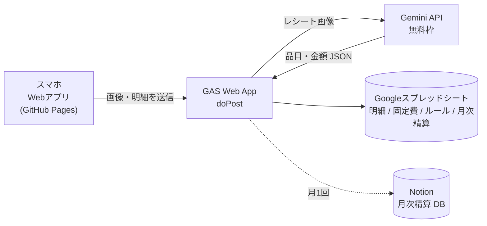
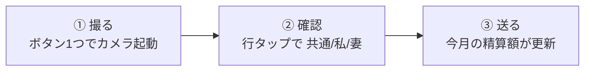

# warikan-app 仕様書（v1）

`作成: 2026-09-17` / 夫婦2人の個人利用専用 / **完全無料**が要件

> このファイルは実装前の壁打ちで決まった内容の確定版です。実装を始める前に必ず全部読んでください。

---

## 1. 目的

夫婦の割り勘で一番のストレスである「**1枚のレシートの中に『私だけ』『妻だけ』『共通』が混ざる仕訳**」と「**月末の精算計算**」をなくす。

- 入力と仕訳が**肝**。ここが面倒なら使われない
- 資産管理・家計簿としての機能は v2 以降（→ 第10章）

## 2. 使う人・環境

| 項目 | 内容 |
|---|---|
| 利用者 | 本人（私）と妻の2人。**妻も自分のスマホから入力する** |
| 主な端末 | スマホ（iPhone Safari / Android Chrome）。ホーム画面に追加して使う |
| 開発環境 | Windows |
| 今の精算方法 | 月末にまとめて精算。その場にいる方が自分のカードで払う。紙レシートを受け取っている。共通支出は**きっちり半分** |
| 精算に含めるもの | レシートの明細 ＋ **固定費（家賃・光熱費・サブスク）** |

## 3. 無料で成立させる構成

| 部品 | 使うもの | 料金 | 条件・注意 |
|---|---|---|---|
| アプリ本体 | GitHub Pages | 0円 | 無料アカウントは **public リポのみ**。秘密情報はコードに入れない |
| 中継・秘密の保管 | GAS（Google Apps Script） | 0円 | Gemini の API キーと合言葉はスクリプトプロパティに置く |
| レシート読み取り | Gemini API 無料枠（Flash 系） | 0円 | 1分10回・1日250〜1,500回 ⚠️数値はアカウントで異なる。AI Studio で確認 |
| データ保存 | Google スプレッドシート | 0円 | GAS から直接読み書き。トークン不要 |
| 月次の結果表示 | Notion（任意・v1.1） | 0円 | 月1行だけ書く |

### 飲んだ前提（本人が了承済み）

1. **リポは public**。GAS の URL と合言葉はコードに書かず、各スマホの設定画面で入力して端末内（localStorage）に保存する
2. **Gemini 無料枠は送った画像が Google のプロダクト改善に使われる**（公式明記）。レシートには店名と品名しか写らないので許容。嫌になったら GAS 側で有料枠に切り替え可能

## 4. 画面

| 画面 | 中身 |
|---|---|
| **① ホーム** | 巨大ボタン「レシートを撮る」＋「金額だけ入力」＋ 今月の精算額（例：妻 → 私 3,240円） |
| **② 確認・仕訳** | 読み取った品目一覧。行タップで 共通/私/妻 切替。合計チェック。送信ボタン |
| **③ 今月の一覧** | 今月の明細（日付・店・金額・支払者・区分）。行タップで区分修正・削除 |
| **④ 月末締め** | 固定費を加算した精算額の確定。「締める」で記録 |
| **⑤ 設定** | 私/妻の選択、GAS URL、合言葉、固定費の編集、ルールの編集 |

## 5. 入力と仕訳の設計【肝】

### 5-1. 撮る（目標：3秒）

| 工夫 | 中身 |
|---|---|
| ホームは巨大ボタン1つ | `<input type="file" accept="image/*" capture="environment">` で直接カメラを開く |
| 端末内で縮小してから送る | Canvas で長辺 1,200px 程度に縮小 → JPEG → base64。通信が速く、無料枠の消費も減る |
| 支払者は自動 | この端末の持ち主（設定で「私/妻」を記憶）。相手のカードで払った時だけタップで切替 |
| レシートなしでも入力可 | 「金額だけ入力」：金額・区分・支払者・メモ。立て替え・現金用 |

### 5-2. 確認・仕訳（目標：共通だけのレシートなら 0タップ）

| 工夫 | 中身 |
|---|---|
| 初期値は全部「共通」 | 共通しかないレシートは確認して送るだけ |
| 行をタップで切替 | 共通 → 私 → 妻 → 共通 と1タップで回る。色で区別（灰・青・桃）。ボタンは親指で押せる大きさ |
| **前回の仕訳を覚える（ルール）** | 「スーパードライ → 私」「本麒麟 → 妻」のようなルール表をスプレッドシートに持ち、**Gemini に渡して読み取りと同時に仕訳案を出させる**。表記ゆれ（"ｽｰﾊﾟｰﾄﾞﾗｲ350"）は AI が吸収。ルール適用行には「🔁」印 |
| ルール登録は仕訳のついで | 行を切り替えた時に「今後もこの品目はこれ」を1タップで ON → ルール表に追加 |
| 合計の自動チェック | 品目の合計とレシートの合計が合わなければ、**差額を「調整（税・割引）」行として自動追加**し「共通」にする。手で電卓を叩かせない |
| 読み取りミスの修正 | 金額タップで数字キーパッド。品名タップで編集。行の追加・削除も可 |
| ヘッダ | 日付（レシートから。編集可）、店名、支払者、合計 |

### 5-3. 送る（目標：安心）

- 送信後「今月の精算：妻 → 私 3,240円」を表示して自動でホームへ
- 失敗したら赤く表示＋再送ボタン。読み取り結果は端末内に残すので撮り直し不要
- ⚠️ オフライン時の自動再送は v1 では作らない

### 5-4. 月末締め

- 「今月を締める」→ 固定費を自動加算 → 精算額を確定 → スプレッドシート「月次精算」に1行記録（Notion にも書くのは v1.1）
- 締めた後に明細を直したら再計算できる（締めは上書き可）

## 6. 精算の計算

**自分の負担額（共通の半分 ＋ 自分の専用分）− 自分が払った額 ＝ 相手に渡す額**（マイナスなら受け取る）

| 区分 | 私の負担 | 妻の負担 |
|---|---|---|
| 共通 | 金額 ÷ 2 | 金額 ÷ 2 |
| 私 | 金額 | 0 |
| 妻 | 0 | 金額 |

- 端数：共通の半分で 0.5 円が出たら**切り捨て**、月合計で最後に丸める（⚠️ 実装時に本人に最終確認）
- 固定費も同じ表で計算する（支払者・区分を固定費ごとに持つ）

## 7. データ設計（Google スプレッドシート）

### シート `明細`（1品目 = 1行）

| 列 | 例 | 用途 |
|---|---|---|
| `id` | r-20260917-001-03 | レシートID＋行番号 |
| `receipt_id` | r-20260917-001 | 同じレシートをまとめる |
| `date` | 2026-09-17 | 精算月の判定 |
| `store` | ライフ 三軒茶屋 | 表示・分析 |
| `item` | スーパードライ 350ml | 品名 |
| `amount` | 228 | 金額（円、整数。割引は負の数） |
| `payer` | me / wife | 支払者 |
| `share` | common / me / wife | 区分（共通/私/妻） |
| `entered_by` | me / wife | 入力者 |
| `created_at` | 2026-09-17 19:32 | 送信時刻 |
| `month` | 2026-09 | 精算月（`date` から自動） |

### シート `固定費`

| 列 | 例 |
|---|---|
| `name` | 家賃 |
| `amount` | 120000 |
| `payer` | me |
| `share` | common |
| `active` | TRUE |

### シート `ルール`

| 列 | 例 |
|---|---|
| `keyword` | スーパードライ |
| `share` | me |
| `created_at` | 2026-09-17 |

### シート `月次精算`

| 列 | 例 |
|---|---|
| `month` | 2026-09 |
| `paid_me` | 45,230 |
| `paid_wife` | 38,750 |
| `burden_me` | 41,990 |
| `burden_wife` | 41,990 |
| `settle_amount` | 3,240 |
| `settle_direction` | wife_to_me |
| `closed_at` | 2026-09-30 21:00 |

## 8. GAS の入口（`doPost` の `action`）

| action | 入力 | 出力 |
|---|---|---|
| `parse` | 画像 base64、ルール一覧は GAS 側で読む | `{date, store, total, items:[{item, amount, share_suggested, rule_applied}]}` |
| `save` | 明細行の配列（確認後） | 保存件数、今月の精算額 |
| `summary` | month | 今月の明細一覧、精算額 |
| `update` | id、share または delete | 更新結果 |
| `fixed` | 固定費の一覧取得・更新 | 固定費一覧 |
| `rule` | keyword、share | ルール一覧 |
| `close` | month | 月次精算の確定結果 |

- すべてのリクエストに `secret`（合言葉）を含め、GAS 側でスクリプトプロパティと照合する
- Gemini は **JSON スキーマ指定（responseSchema）**で構造化出力させる ⚠️利用するモデル名は AI Studio の無料枠一覧から実装時に決める
- Gemini へのプロンプトにはルール一覧を渡し、`share_suggested` を返させる。ルールに該当しなければ `common`

### ⚠️ セキュリティ上の注意

- GAS Web App の URL は「リンクを知っている全員」が実行できる。合言葉で最低限の防御をする
- URL と合言葉は各スマホの設定画面で入力し localStorage に保存。**リポには一切書かない**（public リポのため必須）
- Gemini の API キーはスクリプトプロパティのみ。ログにも出さない

### エラー処理（v1 の範囲）

- Gemini の読み取り失敗・上限超過 → 「読み取れませんでした。手入力に切り替えますか？」→ 金額だけ入力へ
- 保存失敗 → 赤表示＋再送ボタン

## 9. 妻にとっての使い勝手【必須要件】

- **撮る → 自分の分だけタップ → 送る** の3ステップ以上にしない
- 初回設定（私/妻・GAS URL・合言葉）は本人が妻のスマホで代行してよい
- 精算額は妻の画面でも同じ数字が出る（納得感）

## 10. v1 に入れないもの

| 機能 | 理由 |
|---|---|
| 資産の現在地（証券・iDeCo・現金、670万目標、Notion「■ 2026 資産目標」への書き込み） | v2。shisan-app の家計ロジック移植もここ |
| クレカ・銀行 CSV 取込 | v2 |
| AI の月次コメント | v2 |
| Notion「月次精算」DB への書き込み | v1.1（スプレッドシートだけで v1 は成立） |
| 費目分類（食費・日用品…） | v2。Gemini に同時に出させれば安いので後から足せる |
| オフライン自動再送 | v1 は手動再送のみ |
| ログイン機能 | 合言葉で代替 |

## 11. 実装の進め方（メモ）

1. `index.html` だけで「撮る → 縮小 → 仮の品目リスト → 行タップで仕訳 → 精算額計算」まで動かす（GAS なし、ダミーデータ）
2. GAS を作り、スプレッドシート4シートを用意。`save` / `summary` を通す
3. Gemini の `parse` をつなぐ（ルール渡し・JSON スキーマ）。**実物のレシート 5 枚以上で精度確認**
4. 固定費・月末締め・設定画面
5. GitHub Pages に公開 → 2人のスマホでホーム画面に追加 → 妻に触ってもらい、3ステップで済むか確認

**⚠️ 1 の段階で必ず iPhone 実機で「カメラが直接開くか」「行タップが親指で押せるか」を確認する。**
