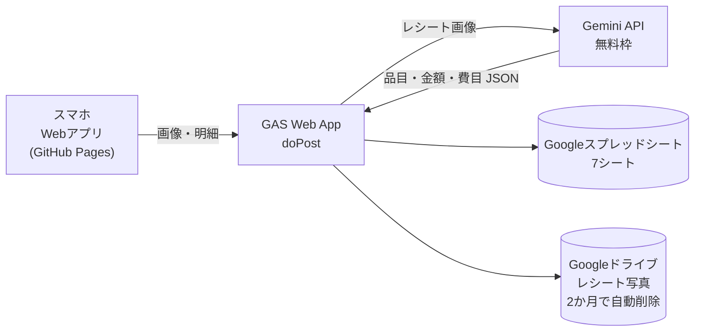
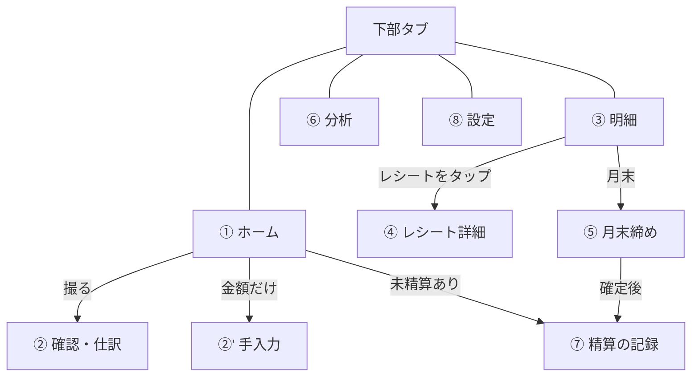
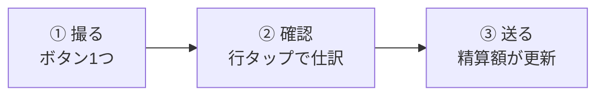
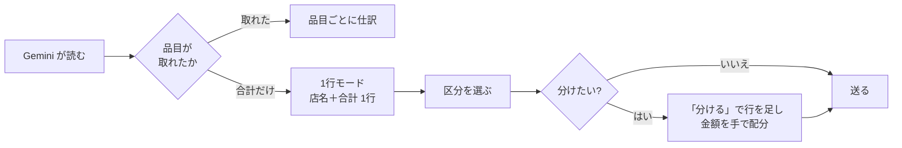
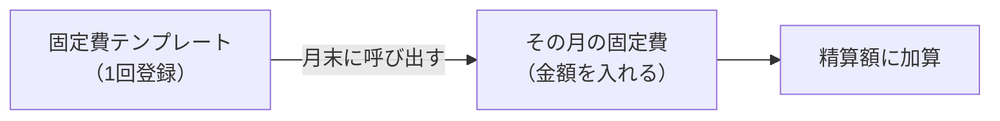
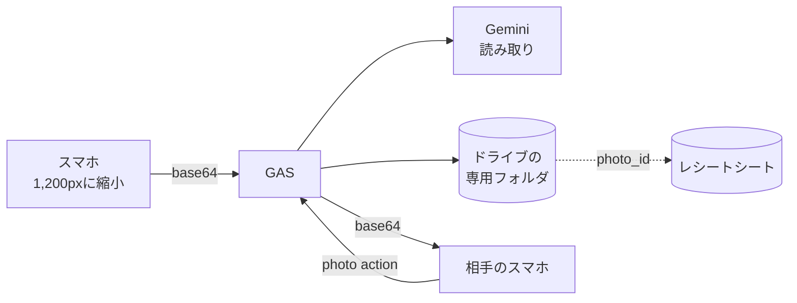
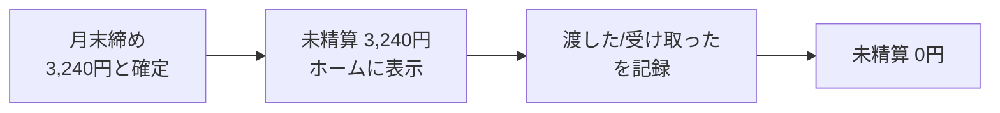
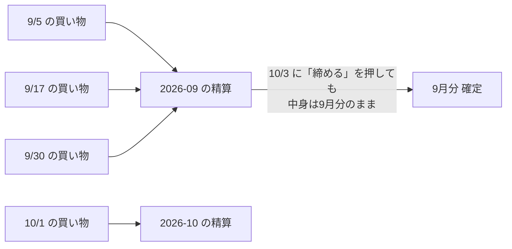

# warikan-app 仕様書（v2）

`作成: 2026-09-17` / `改訂: 2026-09-19` / 夫婦2人の個人利用専用 / **完全無料**が要件

> 実装を始める前に必ず全部読んでください。
> v1 からの変更点は第 0 章にまとめてあります。

---

## 0. v2 で変えたこと

実際に触って出た指摘と、既存の精算サービス（Splitwise・レコペイ・TATEKA など）の標準機能をふまえ、次の 6 点を直しました。

| # | v1 の問題 | v2 の直し方 | 章 |
|---|---|---|---|
| 1 | 明細が品目ごとにバラバラで、どのレシートの買い物か分からない | **レシート単位のカード**で並べ、タップで中身を開く | 5 |
| 2 | 固定費が毎月同じ金額しか扱えない（電気代は毎月変わる） | 固定費を**テンプレート**と**その月の実額**に分ける | 7 |
| 3 | レシート写真が残らず「この支払いはこれ」と 2人で確認できない | **Google ドライブに保存**し、2人ともアプリから見られる | 8 |
| 4 | 明細のないレシート（合計だけ）に対応していない | 合計だけの**1行モード**に自動で切り替える | 6 |
| 5 | 計算するだけで「実際に渡したか」が残らない | **精算の記録**を追加。未精算の残高がホームに出る | 9 |
| 6 | 何にいくら使ったか分からない | **費目の分類とグラフ**を追加（Gemini が読み取りと同時に判定） | 10 |

**決めたこと（本人確認済み）**

- 共通の分担は**きっちり半分のまま**。比率や金額指定は入れない
- レシート写真は Google ドライブに保存し、**2 か月で自動削除**
- 検索・絞り込み、一部精算（分割払い）は v2 以降

---

## 1. 目的

夫婦の割り勘で一番のストレスである「**1枚のレシートの中に『私だけ』『妻だけ』『共通』が混ざる仕訳**」と「**月末の精算計算**」をなくす。

- 入力と仕訳が**肝**。ここが面倒なら使われない
- 資産管理としての機能は v3 以降（→ 第 14 章）

## 2. 使う人・環境

| 項目 | 内容 |
|---|---|
| 利用者 | 本人（私）と妻の2人。**妻も自分のスマホから入力する** |
| 主な端末 | スマホ（iPhone Safari / Android Chrome）。ホーム画面に追加して使う |
| 開発環境 | Windows |
| 精算方法 | 月末にまとめて精算。その場にいる方が自分のカードで払う。共通支出は**きっちり半分** |
| 精算に含めるもの | レシートの明細 ＋ **固定費（家賃・光熱費・サブスク）** |

## 3. 無料で成立させる構成

| 部品 | 使うもの | 料金 | 条件・注意 |
|---|---|---|---|
| アプリ本体 | GitHub Pages | 0円 | 無料アカウントは **public リポのみ**。秘密情報はコードに入れない |
| 中継・秘密の保管 | GAS（Google Apps Script） | 0円 | Gemini の API キーと合言葉はスクリプトプロパティに置く |
| レシート読み取り | Gemini API 無料枠（Flash 系） | 0円 | 1分10回・1日250〜1,500回 ⚠️数値はアカウントで異なる。AI Studio で確認 |
| データ保存 | Google スプレッドシート | 0円 | GAS から直接読み書き |
| 写真保存 | Google ドライブ | 0円 | 無料 15GB。長辺1,200pxのJPEGで1枚約150KB |

### 飲んだ前提（本人が了承済み）

1. **リポは public**。GAS の URL と合言葉はコードに書かず、各スマホの設定画面で入力して端末内（localStorage）に保存する
2. **Gemini 無料枠は送った画像が Google のプロダクト改善に使われる**（公式明記）。レシートには店名と品名しか写らないので許容。嫌になったら GAS 側で有料枠に切り替え可能

## 4. 画面

| 画面 | 中身 |
|---|---|
| **① ホーム** | 今月の精算額 ＋ **未精算の残高** ＋「レシートを撮る」「金額だけ入力」 |
| **② 確認・仕訳** | 読み取った品目一覧。行タップで 共通/私/妻。合計チェック。**明細なしレシートは1行モード** |
| **③ 明細** | **レシート単位のカード**を月ごとに表示。月の切替（← →） |
| **④ レシート詳細** | **写真** ＋ 品目一覧 ＋ 区分の修正・削除 |
| **⑤ 月末締め** | その月の固定費を入力 → 精算額を確定 → 「締める」 |
| **⑥ 分析** | 費目別グラフ、共通/私/妻の内訳、前月との比較 |
| **⑦ 精算の記録** | 「渡した／受け取った」を記録。履歴と残高 |
| **⑧ 設定** | 私/妻、GAS URL、合言葉、固定費テンプレート、仕訳ルール |

下部タブは **ホーム / 明細 / 分析 / 設定** の 4 つ。月末締めは明細の下、精算の記録はホームから入る。

## 5. 明細はレシート単位で見せる【指摘1】

品目を1行ずつ並べると、どの買い物のものか分からなくなる。**レシート1枚＝カード1枚**にする。

### 5-1. カードに載せるもの

| 要素 | 例 |
|---|---|
| 日付・店名 | 09/17 ライフ 三軒茶屋 |
| 合計・支払者 | 2,300円・私が支払い |
| 区分の内訳 | 共通 1,914 / 私 228 / 妻 158（色付きの帯） |
| 写真 | 左に小さなサムネイル（あれば） |
| 品目数 | 8品目 |

### 5-2. タップで詳細（④ レシート詳細）

- 写真を大きく表示（タップでさらに拡大）
- 品目の一覧。ここで区分の修正・金額の修正・行の削除ができる
- レシートごと削除もできる

> 手入力（レシートなし）も同じカードで表示する。写真とお店の欄が空になるだけ。

## 6. 入力と仕訳【肝】

### 6-1. 撮る（目標：3秒）

| 工夫 | 中身 |
|---|---|
| ホームは巨大ボタン1つ | `<input type="file" accept="image/*" capture="environment">` でカメラを直接開く |
| 端末内で縮小してから送る | Canvas で長辺 1,200px → JPEG(品質0.8) → base64。通信も無料枠の消費も減る |
| 支払者は自動 | 端末の持ち主（設定で記憶）。相手のカードの時だけタップで切替 |
| レシートなしでも入力可 | 「金額だけ入力」：金額・区分・支払者・費目・メモ |

### 6-2. 確認・仕訳（目標：共通だけなら 0タップ）

| 工夫 | 中身 |
|---|---|
| 初期値は全部「共通」 | 共通しかないレシートは確認して送るだけ |
| 行タップで切替 | 共通 → 私 → 妻 → 共通。色で区別（灰・青・桃） |
| まとめて切替 | 「全部 共通 / 全部 私 / 全部 妻」を上に置く |
| **前回の仕訳を覚える** | ルール表を Gemini に渡し、読み取りと同時に仕訳案を出させる。表記ゆれは AI が吸収。ルール適用行に「🔁」 |
| ルール登録は仕訳のついで | 区分を変えた時に「今後もこれ」を1タップで ON |
| 合計の自動チェック | 品目合計とレシート合計が合わなければ差額を「調整（税・割引）」行として自動追加し「共通」にする |
| 集計バー | 共通・私・妻の内訳を帯グラフで常に表示 |

### 6-3. 明細のないレシートに対応する【指摘4】

手書きの領収書、感熱紙が薄いレシート、明細を印字しない店がある。

- Gemini が `items: []` を返したら、アプリが**店名と合計で1行だけ**作る（品名は店名、なければ「お買い物」）
- その1行に 共通/私/妻 を割り当てれば完了。**最短1タップ**
- 分けたい時は「分ける」ボタンで行を追加し、金額を手で入れる。残りは自動で最後の行に入る
- 画面上部に「明細が読み取れませんでした。合計だけで登録します」と出す

### 6-4. 送る

- 送信後「今月の精算：妻 → 私 3,240円」を表示して自動でホームへ
- 失敗したら赤く表示＋再送ボタン。読み取り結果は端末内に残すので撮り直し不要
- ⚠️ オフライン時の自動再送は作らない（手動再送のみ）

## 7. 固定費は月ごとに金額が変わる【指摘2】

家賃は毎月同じだが、電気代・ガス代・水道代は毎月違う。**テンプレート**と**その月の実額**を分ける。

### 7-1. テンプレート（設定画面で1回登録）

| 列 | 例 | 説明 |
|---|---|---|
| `name` | 家賃 / 電気代 | 項目名 |
| `kind` | `fixed` / `variable` | 定額か、毎月変わるか |
| `amount_default` | 120000 / 0 | 定額ならこの金額。変動なら先月の額を初期値にする |
| `payer` | me / wife | 引き落とし先の名義 |
| `share` | common / me / wife | 区分 |
| `active` | TRUE | 使うかどうか |

### 7-2. その月の実額（月末締めの画面で入力）

- 「締める」を押すと、テンプレートから**今月の行**が並ぶ
- `fixed`（家賃など）は金額が自動で入る
- `variable`（電気代など）は**空欄で赤く表示**され、入力しないと締められない。初期値として先月の額を薄く出す
- 入力した実額は `固定費実績` シートに月ごとに残る。翌月の初期値にも使う
- その月だけの臨時の項目（例：火災保険の年払い）もここで1行足せる

### 7-3. ホームの表示との関係

ホームの精算額は**レシート分だけ**。固定費は締める時に加算される。金額が大きく変わるので、ホームに「固定費は月末の締めで加算されます」と注意書きを出す。

## 8. レシート写真の保存【指摘3】

「この支払いはこれ」と2人で確認できるようにする。

| 項目 | 決めたこと |
|---|---|
| 保存先 | Google ドライブの専用フォルダ（**非公開**） |
| 形式 | 長辺 1,200px の JPEG（読み取りに送るのと同じ画像を使い回す） |
| 容量 | 1枚 約150KB。月100枚でも 2か月分で 30MB |
| 見る方法 | アプリ →（合言葉付きで）GAS → ドライブ → base64 で返す。**ドライブを公開設定にしない** |
| 保存期間 | **撮影から 2 か月（62日）で自動削除** |
| 削除の仕組み | GAS の時間主導トリガーで1日1回。期限切れのファイルを消し、シートの `photo_id` を空にする |
| 保存期間の変更 | スクリプトプロパティ `PHOTO_KEEP_DAYS` で変えられる |

### ⚠️ 2か月で消えることの意味

- 月末の精算には十分（9月のレシートは11月末まで残る）
- **1年前のレシートを見返すことはできない**。文字データ（日付・店・品名・金額）は消えずに残る
- 長く残したくなったら `PHOTO_KEEP_DAYS` を伸ばす。15GB なので数年分入る

## 9. 精算の記録【指摘5】

v1 は金額を計算するだけで、**実際に渡したかどうか**が残らなかった。Splitwise などは「settle up」として記録するのが標準。

| 項目 | 内容 |
|---|---|
| 記録するもの | 日付・向き（私→妻 / 妻→私）・金額・方法（現金 / 振込 / PayPay など）・メモ |
| 未精算の残高 | 締めた金額の合計 − 記録した精算額の合計 |
| ホームの表示 | 未精算があれば「未精算 3,240円 ＞」を出す。0円なら出さない |
| 履歴 | いつ・いくら・どの方法で精算したかを一覧で残す |
| 修正 | 記録の削除・修正ができる |

> ⚠️ 一部だけ払う（3,240円のうち3,000円だけ渡す）は v2 以降。v1 は全額の記録のみ。

## 10. 費目の分類とグラフ【指摘6】

| 項目 | 内容 |
|---|---|
| 費目 | 食費 / 外食 / 日用品 / 交通 / 娯楽 / 医療 / 衣類 / 水道光熱 / 通信 / その他 |
| 判定 | **Gemini が読み取りと同時に返す**（`category`）。追加の費用はほぼゼロ |
| 修正 | レシート詳細で品目ごとに変えられる |
| グラフ | 月の費目別（横棒）、共通/私/妻の内訳（帯）、前月との比較 |
| 手入力 | 費目を選ぶ欄を付ける。初期値は「その他」 |

## 11. 精算の計算

### 11-0. どの月の分を精算するか【重要】

**精算は「レシートの日付が属する月」でまとめる。ボタンを押した日は関係ない。**

| 例 | どう扱うか |
|---|---|
| 10月3日に「9月を締める」を押した | **9/1〜9/30 に登録された分だけ**が対象。10/1 や 10/2 の買い物は入らない |
| 10月3日に精算を記録した | 「2026年9月分」として記録される。記録日は 10/3 のままでよい |
| 固定費 | 月ごとに実額を持つ。9月の締めには 9月分の固定費だけが入る |
| 締めた後に9月の明細を直した | もう一度「締め直す」を押せば9月の金額が更新される |

- 月の判定は `date`（レシートの日付）から自動で決める。`created_at`（送信時刻）では判定しない
- 画面にも「2026年9月に登録された分（9/1〜9/30）だけが対象です。今日の日付は関係ありません」と表示する
- 明細の一覧で月を切り替えてから締めるので、**先月・先々月を後から締めることもできる**

### 11-1. 計算式

**自分の負担額（共通の半分 ＋ 自分の専用分）− 自分が払った額 ＝ 相手に渡す額**（マイナスなら受け取る）

| 区分 | 私の負担 | 妻の負担 |
|---|---|---|
| 共通 | 金額 ÷ 2 | 金額 ÷ 2 |
| 私 | 金額 | 0 |
| 妻 | 0 | 金額 |

- 端数：**共通の月合計を半分にして切り捨て**（行ごとではなく、月合計で1回だけ）。1円は精算しない
- 固定費も同じ表で計算する（支払者・区分を項目ごとに持つ）
- 締めの画面で「払った額 / 負担する額 / 差額」を表で見せ、なぜその金額になるか分かるようにする

## 12. データ設計（Google スプレッドシート）

v1 の `明細` シートから、レシート単位の情報を `レシート` シートに分けた。これで指摘1（レシート単位の表示）が素直に書ける。

### シート `レシート`（レシート1枚 = 1行）

| 列 | 例 | 用途 |
|---|---|---|
| `receipt_id` | r-20260917-001 | 主キー |
| `date` | 2026-09-17 | 精算月の判定 |
| `store` | ライフ 三軒茶屋 | 表示・分析 |
| `total` | 2300 | レシートの合計 |
| `payer` | me / wife | 支払者 |
| `entered_by` | me / wife | 入力者 |
| `photo_id` | 1a2B3c... | ドライブのファイルID（消えたら空） |
| `has_items` | TRUE / FALSE | 明細が読み取れたか（指摘4） |
| `month` | 2026-09 | 精算月（`date` から自動） |
| `created_at` | 2026-09-17 19:32 | 送信時刻 |

### シート `明細`（1品目 = 1行）

| 列 | 例 |
|---|---|
| `id` | r-20260917-001-03 |
| `receipt_id` | r-20260917-001 |
| `item` | スーパードライ 350ml |
| `amount` | 228（割引は負の数） |
| `share` | common / me / wife |
| `category` | 食費 |
| `rule_applied` | TRUE |

### シート `固定費テンプレート`

| 列 | 例 |
|---|---|
| `id` | f-001 |
| `name` | 電気代 |
| `kind` | variable |
| `amount_default` | 0 |
| `payer` | me |
| `share` | common |
| `active` | TRUE |

### シート `固定費実績`

| 列 | 例 |
|---|---|
| `month` | 2026-09 |
| `template_id` | f-001（臨時の項目は空） |
| `name` | 電気代 |
| `amount` | 9840 |
| `payer` | me |
| `share` | common |

### シート `ルール`

| 列 | 例 |
|---|---|
| `keyword` | スーパードライ |
| `share` | me |
| `created_at` | 2026-09-17 |

### シート `月次精算`

| 列 | 例 |
|---|---|
| `month` | 2026-09 |
| `paid_me` / `paid_wife` | 45230 / 38750 |
| `burden_me` / `burden_wife` | 41990 / 41990 |
| `settle_amount` | 3240 |
| `settle_direction` | wife_to_me |
| `closed_at` | 2026-09-30 21:00 |

### シート `精算記録`

| 列 | 例 |
|---|---|
| `id` | p-20261001-001 |
| `month` | 2026-09 |
| `date` | 2026-10-01 |
| `direction` | wife_to_me |
| `amount` | 3240 |
| `method` | 振込 |
| `memo` | 9月分 |
| `created_at` | 2026-10-01 20:10 |

## 13. GAS の入口（`doPost` の `action`）

| action | 入力 | 出力 |
|---|---|---|
| `parse` | 画像 base64 | `{date, store, total, has_items, photo_id, items:[{item, amount, category, share_suggested, rule_applied}]}` |
| `save` | レシート1件＋明細の配列 | 保存件数、今月の精算額 |
| `summary` | month | レシート単位の一覧、精算額、未精算残高 |
| `receipt` | receipt_id | レシート1件の詳細（品目つき） |
| `photo` | receipt_id | 写真の base64（なければ空） |
| `update` | id、share / category / amount、または delete | 更新結果 |
| `fixedTemplate` | 取得・更新 | テンプレート一覧 |
| `fixedMonth` | month、実額の配列 | その月の固定費一覧 |
| `close` | month | 月次精算の確定結果 |
| `settle` | 精算の記録（追加・削除） | 記録一覧、未精算残高 |
| `rule` | keyword、share | ルール一覧 |
| `stats` | month | 費目別・区分別の集計 |

- すべてのリクエストに `secret`（合言葉）を含め、GAS 側でスクリプトプロパティと照合する
- Gemini は **JSON スキーマ指定（responseSchema）** で構造化出力させる ⚠️モデル名は AI Studio の無料枠一覧から実装時に決める
- Gemini へのプロンプトにはルール一覧と費目の一覧を渡す

### ⚠️ セキュリティ上の注意

- GAS Web App の URL は「リンクを知っている全員」が実行できる。合言葉で最低限の防御をする
- URL と合言葉は各スマホの設定画面で入力し localStorage に保存。**リポには一切書かない**（public リポのため必須）
- Gemini の API キーはスクリプトプロパティのみ。ログにも出さない
- **ドライブのフォルダは公開しない**。写真は必ず GAS 経由（合言葉つき）で取得する

### エラー処理

| 起きること | どうする |
|---|---|
| Gemini の読み取り失敗・上限超過 | 「読み取れませんでした」→ 合計だけの1行モードに切り替える（第6-3章） |
| 明細は取れたが合計が合わない | 差額を「調整」行として自動追加 |
| 保存失敗 | 赤表示＋再送ボタン。読み取り結果は端末内に残す |
| 写真が期限切れで消えている | 詳細画面に「写真は2か月で自動削除されました」と出す |
| 合言葉が違う | 「合言葉が違います。設定を確認してください」 |

## 14. v1 に入れないもの

| 機能 | 理由 |
|---|---|
| 分担比率の変更（60:40 など） | きっちり半分が要件。必要になったら追加 |
| 一部精算（分割で渡す） | v2 |
| 検索・絞り込み | v2 |
| 資産の現在地（証券・iDeCo・現金、Notion 連携） | v3 |
| クレカ・銀行 CSV 取込 | v3 |
| AI の月次コメント | v3 |
| Notion「月次精算」DB への書き込み | v2 |
| オフライン自動再送 | 手動再送のみ |
| ログイン機能 | 合言葉で代替 |
| プッシュ通知 | 無料構成では作れない |

## 15. 妻にとっての使い勝手【必須要件】

- **撮る → 自分の分だけタップ → 送る** の3ステップ以上にしない
- 明細のないレシートは**区分を1タップ**で終わる
- 初回設定（私/妻・GAS URL・合言葉）は本人が妻のスマホで代行してよい
- 精算額も、写真も、妻の画面で同じものが見える（納得感）
- ボタンは親指で押せる大きさ（44px 以上）を守る

## 16. 実装の進め方

> v1 は localStorage だけで動く「ダミー版」を先に作ったが、写真の保存と「双方が見られる」は
> GAS・スプレッドシート・ドライブが前提になる。**土台を先に作る**方が作り直しが減る。

| 段階 | やること | 確認方法 |
|---|---|---|
| **1** | スプレッドシート7シートを用意。GAS で `save` / `summary` / `receipt` を通す | 手入力で1件保存し、相手のスマホに出るか |
| **2** | 写真：ドライブ保存、`photo` で取得、日次の自動削除トリガー | 2人の端末で同じ写真が見えるか |
| **3** | Gemini の `parse`（ルール・費目・JSONスキーマ）。**実物のレシート5枚以上**で精度確認 | 明細なしレシートも1枚は試す |
| **4** | 画面：レシート単位の明細、レシート詳細、1行モード | iPhone 実機 |
| **5** | 固定費テンプレート ＋ その月の実額 ＋ 月末締め | 変動費が未入力だと締められないか |
| **6** | 精算の記録と未精算残高 | 締める → 記録 → 残高0 になるか |
| **7** | 分析（費目別グラフ） | 数字がグラフと一致するか |
| **8** | GitHub Pages に公開 → 2人のスマホでホーム画面に追加 → 妻に触ってもらう | 3ステップで済むか |

**⚠️ 段階4 で必ず iPhone 実機で「カメラが直接開くか」「行タップが親指で押せるか」を確認する。**

---

## 付録：調べた既存サービスと、参考にした点

| サービス | 参考にした機能 |
|---|---|
| Splitwise | レシート撮影から品目を自動検出して割り当てる／**settle up（精算の記録）**／残高の表示 |
| レコペイ | レシート読み取り＋共有家計簿／夫婦・カップル向けの共有 |
| TATEKA | 立て替えた人と負担する人を分けて記録／精算履歴を時系列で一覧 |
| 家計簿アプリ全般 | 費目別のグラフ／写真の添付／メモ |

出典：
- [Splitwise 公式](https://www.splitwise.com/)
- [What Is Splitwise? How It Works, Costs & Limits (2026)](https://usefairsplit.com/comparisons/what-is-splitwise/)
- [Splitwise feedback（部分精算・残高表示）](https://feedback.splitwise.com/forums/162446-general/suggestions/8278218-allow-partial-settlement-of-bills)
- [【2026年】割り勘アプリおすすめ4選 - アプリブ](https://app-liv.jp/lifestyle/all/1044/)
- [割り勘・立て替え・精算アプリ TATEKA](https://tateka.app/)
- [共有できる家計簿アプリおすすめ9選 - アプリブ](https://app-liv.jp/lifestyle/finance/3682/)
